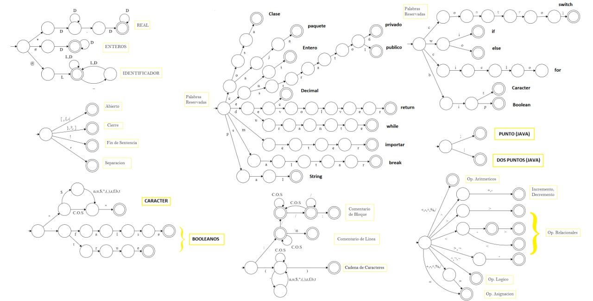

# Compilador NN

Compilador para el lenguaje de programacion **NN** propuesto como 
proyecto para la materia Compiladores de la Universidad del Quindio.
Este compilador fue escrito en Kotlin con la intencion de compilar
al lenguaje de Java.

#### Desarrollado por:
* Yesid Rosas Toro
* Samara Rincon
* Cristian Camilo Quiceno

## Fase 1. Analizador Lexico

La primera entrega del proyecto consiste en un analizador lexico
el cual se encargará de reconocer todas las palabras que conforman
nuestro lenguaje en un archivo de texto el cual llamaremos 
**Codigo Fuente**. A partir de este codigo fuente extraeremos las
palabras o **Tokens** las cuales son necesarias para continuar
con el Analisis Sintactico.

Paralelo a esto nuestro analizador lexico tambien generara una **Rutina
de errores**, es decir, una lista de errores lexicos que genero el 
analizador. Estos errores pueden ser **Palabras desconocidas** que 
el analizador fue incapaz de reconocer.

### Herramientas Lexicas

Para que el analizador lexico pueda reconocer un Token, requiere de 
una herramienta que le permita determinar si una palabra existe en el 
lenguaje. Las herramientas mas comunmente usadas para la representacion 
lexica de los lenguaje de programacion son las **Expresiones Regulares** 
y los **Automata Finito Determinista** que permite describir las 
transiciones que tendra una palabra caracter por caracter.

El automata usado para este lenguaje es el siguiente:

### Estructura Lexica

A partir de las herramientas anteriormente vistas, se puede fijar
unas reglas que definen nuestro lenguaje de programacion. Es entonces 
asi como empezamos a construir nuestro lenguaje partiendo desde las 
palabras que lo componen. Estas palabras o Tokens son:

##### Comentarios:
~~~
: Los comentarios de linea se escriben asi

:/
    Los comentarios 
    de bloque se 
    escriben asi
/:
~~~

##### Palabras Reservadas:
~~~
ent         : Tipo de dato de Numeros enteros
dec         : Tipo de dato de Numeros reales
pal         : Tipo de dato de Cadenas de caracteres

caja        : Token relativo al "package" de Java
meter       : Token relativo al "import" de Java

cosa        : Token relativo al "class" de Java
estrato1    : Modificador de acceso "public"
estrato6    : Modificador de acceso "private"

durante     : Estructura de control ciclica "while"
devolver    : Token relativo al "return" de Java
saltar      : Token relativo al "Break" de Java
control     : Estructura de control "Switch"
ciclo       : Estructura de control ciclica "for"
wi - wo     : Estructura condicional "if - else"

bit         :Tipo de dato de caracter
bip         :Tipo de dato de booleano

~~~

##### Identificadores:
~~~
@id         : Los identificadores deben empezar por @
@palabra    
@identificador
~~~

##### Enteros, Reales, Cadenas y valore T/F:
~~~
#0123456789  : Enteros

*0123.456789 : Reales

(Hola mundo) : Cadena de caracteres

.false       : Valor booleano
.true

~~~

##### Caracteres Especiales:
~~~
:$n      :Nueva linea
:$u      :salto
:$$      :Comillas simples
:$”      :Comillas dobles
:$(
:$)
:$r      :Retorno carro
:$f      :Salto de linea (Formfeed)
:$b      :Retroceso (Backspace)
:$t      :tab

~~~

##### Operadores Relacionales + Operadores Logicos
~~~
:Operadores Relacionales
:>>      :Es el mayor relativo ">" en Java
:>-      :Es el mayor o igual relativo ">=" en Java
:<<      :Es el menor relativo "<" en Java
:<-      :Es el menor o igual relativo "<=" en Java
:<->     :Es igual igual relativo "==" en Java
:¬-      :Es diferente igual relativo "!=" en java

:Operadores Logicos
:^        Es relativo "&&" en Java
:~        Es ralativo "||" en Java
:¬        Es relativo "!" en Java

~~~

##### Operador de Asignacion y Terminal:
~~~
: Los operadores de asignaciones
(+ - ° / % ) U (=) y (=)

: El terminal o final de sentencia es un signo de exclamacion (!)
 
: Signatura en NN           | Signatura en JAVA
ent @numero = #0!           : int numero = 0;
pal @cadena = (Hola mundo)! : String cadena = "Hola mundo";
~~~

##### Operadores aritmeticos + (Decremento e Incremento)
~~~
ent @a = #1!
ent @b = #2!

@a^+!           : El operador de incremento es ^+
@b^-!           : El operador de decremento es ^-

ent @c!
@c = @a + @b!   : Suma
@c = @a - @b!   : Resta
@c = @a ° @b!   : Multiplicacion
@c = @a / @b!   : Division
@c = @a % @b!   : Modulo
~~~

##### Otros elementos importantes:
~~~
: "¿" Es el relativo al "{" en Java
: "?" Es el relativo al "}" en Java
: "]" Es el relativo al "(" en Java
: "[" Es el relativo al ")" en Java
: "}" Es el relativo al "]" en java
: "{" Es el relativo al "[" en java
: "," Es el relativo al "," en Java 
: ";" Es el relativo al "." en java
: "|" Es el ralativo al ":" en java

estrato1 cosa @clase ¿          : Las llaves son interrogaciones (¿?)

    ent @a = #1! , @b = #2!     : El separador es ,

    ent @c = [@a + @b] , @a     : Los operadores de agrupacion son ([])
 
?                                
~~~
